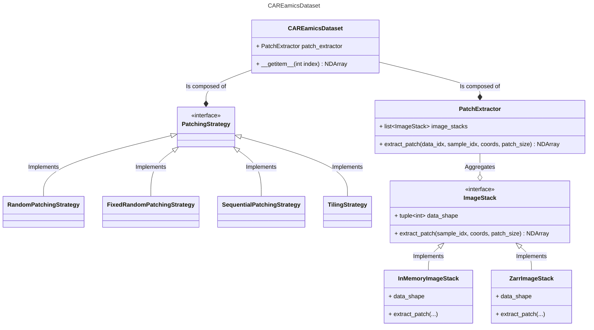

# The CAREamics Dataset

Welcome to the CAREamics dataset! 

A PyTorch based dataset, designed to be used with microscopy data. It is universal for the training, validation and prediction stages of a machine learning pipeline. 

The key ethos is to create a modular and maintable dataset comprised of swappable components that interact through interfaces. This should facilitate a smooth development process when extending the dataset's function to new features, and also enable advanced users to easily customise the dataset to their needs, by writing custom components. This is acheived by following a few key software engineering principles.

## Key Principles

The following principles have a lot of cross over. (TODO: explain better)

### Composition over inheritance

The principle of composition over inheritance is: rather than using inheritance to extend or change the behaviour of a class, instead, a class can be composed of modules that can be swapped to extend or change behaviour.

The reason to use composition is that it promotes the easy reuse of the underlying components, it can prevent a subclass explosion, and it leads to a maintainable and easily extendable design. A software architecture based on composition is normally maintainable and extendable because if a component needs to change then the whole class shouldn't have to be refactored and if a new feature needs to be added, normally an additional component can be added to the class.

For a more in-depth example on how inheritance can complexify code see this [example](example_composition_over_inheritance.md).

### Dependency inversion

The dependency inversion principle states:

1. High-level modules should not depend on low-level modules. Both high-level and low-level modules should depend on abstractions (e.g. interfaces).
2. Abstractions should not depend on details (concrete implementations). Details should depend on abstractions.

In other words high level modules that provide complex logic should be easily reusable and not depend on implementation details of low-level modules that provide utility functionality. This can be achieved by introducing abstractions that decouple high and low level modules.

### The Strategy Pattern + Factory Pattern

### Classes with well a defined responsibility

## Dataset Component overview

### `ImageStack`

### `PatchExtractor`

### `PatchingStrategy`

### `Transforms`