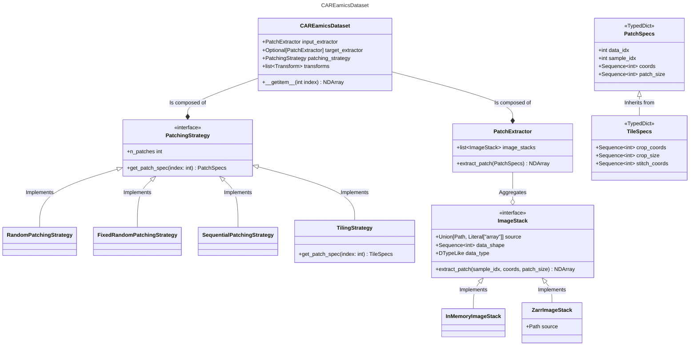

# The CAREamics Dataset

Welcome to the CAREamics dataset! 

A PyTorch based dataset, designed to be used with microscopy data. It is universal for the training, validation and prediction stages of a machine learning pipeline. 

The key ethos is to create a modular and maintainable dataset comprised of swappable components that interact through interfaces. This should facilitate a smooth development process when extending the dataset's function to new features, and also enable advanced users to easily customize the dataset to their needs, by writing custom components. This is achieved by following a few key software engineering principles, detailed at the end of this README file.

## Dataset Component overview

### `ImageStack` and implementations

This interface represents a set of image data, which can be saved with any subset of the
axes STCZYX, in any order, see below for a description of the dimensions. The `ImageStack` 
interface's job is to act as an adapter for different data storage types, so that higher 
level classes can access the image data without having to know the implementation details of 
how to load or read data from each storage type. This means we can decide to support new storage 
types by implementing a new concrete `ImageStack` class without having to change anything 
in the `CAREamistDataset` class. Advanced users can also choose to create their own 
`ImageStack` class if they want to work with their own data storage type.

The interface provides an `extract_patch` method which will produce a patch from the image, 
as a NumPy array, with the dimensions C(Z)YX. This method should be thought of as simply
a wrapper for the equivalent to NumPy slicing for each of the storage types.

#### Concrete implementations

- `InMemoryImageStack`: The underlying data is stored as a NumPy array in memory. It has some
additional constructor methods to load the data from known file formats such as TIFF files.
- `ZarrImageStack`: The underlying data is stored as a ZARR file on disk.

#### Axes description

- S is a generic sample dimension,
- T is a time dimension,
- C is a channel dimension,
- Z is a spatial dimension,
- Y is a spatial dimension,
- X is a spatial dimension.

### `PatchExtractor`

The `PatchExtractor` class aggregates many `ImageStack` instances, this allows for multiple 
images with different dimensions, and possibly different storage types to be treated as a single entity. 
The class has an `extract_patch` method to extract a patch from any one of its `ImageStack` 
objects. It can also possibly be extended when extra logic to extract patches is needed, 
for example when constructing lateral-context inputs for the MicroSplit LVAE models.

### `PatchingStrategy`

The `PatchingStrategy` class is an interface to generate patch specifications, where each of the
concrete implementations produce a set of patch specifications using a different strategy.

It has a `n_patches` attribute that can be accessed to find out how many patches the 
strategy will produce, given the shapes of the image stacks it has been initialized with. 
This is needed by the `CAREamicsDataset` to return its length.

Most importantly it has a `get_patch_spec` method, that takes an index and returns a 
patch specification. For deterministic patching strategies, this method will always 
return the same patch specification given the same index, but there are also random strategies
where the returned patch specification will change every time. The given index can never 
be greater than `n_patches`.

#### Concrete implementations

- `RandomPatchingStrategy`: this strategy will produce random patches that will change 
even if the `extract_patch` method is called with the same index.
- `FixedRandomPatchingStrategy`: this strategy will produce random patches, but the patch 
will be the same if the `extract_patch` method is called with the same index. This is 
useful for making sure validation is comparable epoch to epoch.
- `SequentialPatchingStrategy`: this strategy is deterministic and the patches will be
sequential with some specified overlap.
- `TilingStrategy`: this strategy is deterministic and the patches will be
sequential with some specified overlap. Rather than a `PatchSpecs` dictionary it will
produce a `TileSpecs` dictionary which includes some extra fields that are used for 
stitching the tiles back together.

#### PatchSpecs

The `get_patch_spec` returns a dictionary containing the keys `data_idx`, `sample_idx`, `coords` and `patch_size`.
These are the exact arguments that the `PatchExtractor.extract_patch` method takes. The patch specification
produced by the patching strategy is received by the `PatchExtractor` to in-turn produce an image patch.

For type hinting, `PatchSpecs` is defined as a `TypedDict`.

## Key Principles

The aim of all these principles is to create a system of interacting classes that have
low coupling. This allows for one section to be changed or extended without breaking functionality
elsewhere in the codebase.

### Composition over inheritance

The principle of composition over inheritance is: rather than using inheritance to
extend or change the behavior of a class, instead, a class can be composed of modules 
that can be swapped to extend or change behavior.

The reason to use composition is that it promotes the easy reuse of the underlying 
components, it can prevent a subclass explosion, and it leads to a maintainable and 
easily extendable design. A software architecture based on composition is normally 
maintainable and extendable because if a component needs to change then the whole class 
shouldn't have to be refactored and if a new feature needs to be added, usually an additional 
component can be added to the class.

The `CAREamicsDataset` is composed of `PatchExtractor` and `PatchingStrategy` and `Transfrom` components. 
The `PatchingStrategy` classes implement an interface so the dataset can switch between 
different strategies. The `PatchExtractor` is composed of many `ImageStack` instances, 
new image stacks can be added to extend the type of data that the dataset can read from.

### Dependency Inversion

The dependency inversion principle states:

1. High-level modules should not depend on low-level modules. Both high-level and 
low-level modules should depend on abstractions (e.g. interfaces).
2. Abstractions should not depend on details (concrete implementations). Details should 
depend on abstractions.

In other words high level modules that provide complex logic should be easily reusable 
and not depend on implementation details of low-level modules that provide utility functionality. 
This can be achieved by introducing abstractions that decouple high and low level modules.

An example of the dependency inversion principle in use is how the `PatchExtractor` only
depends on the `ImageStack` interface, and does not have to have any knowledge of the 
concrete implementations. The concrete `ImageStack` implementations also do not have 
any knowledge of the `PatchExtractor` or any other higher-level functionality that the
dataset needs.

### Single Responsibility Principle

Each component should have a small scope of responsibility that is easily defined. This 
should make the code easier to maintain and hopefully reduce the number of places in the
code that have to change when introducing a new feature.

- `ImageStack` responsibility: to act as an adapter for loading and reading image data 
from different underlying storage.
- `PatchExtractor` responsibility: to extract patches from a set of image stacks.
- `PatchingStrategy` responsibility: to produce patch specifications given an index, through 
an interface that hides the underlying implementation.
- `CAREamicsDataset` responsibility: to orchestrate the interactions of its underlying 
components to produce an input patch (and target patch when required) given an index.
