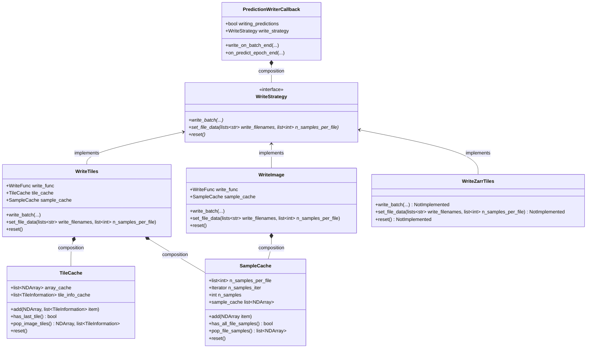
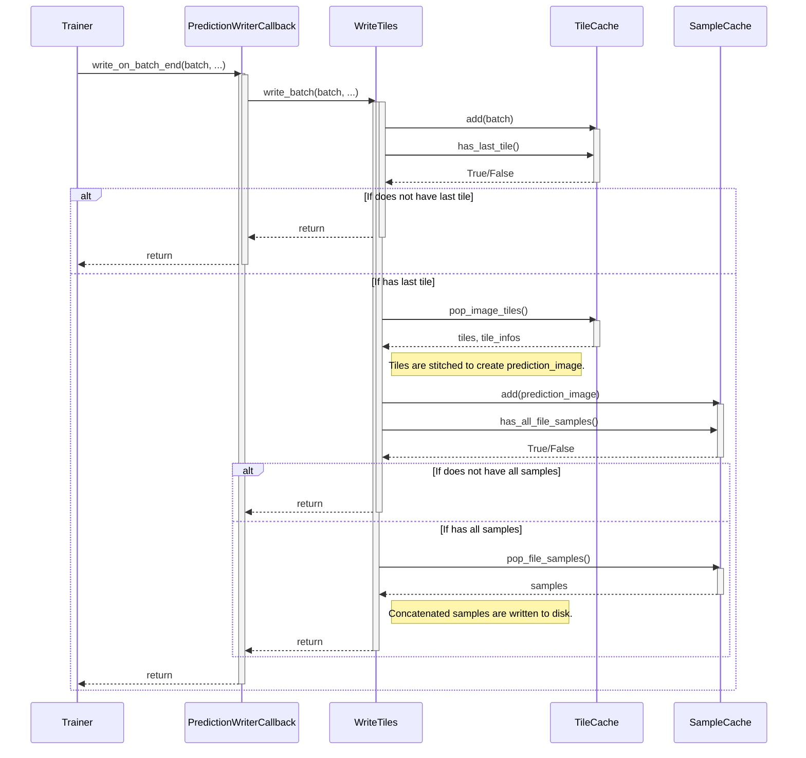

# `PredictionWriterCallback`

## Class diagram for `PredictionWriteCallback` related classes

```mermaid
classDiagram
    PredictionWriterCallback*--WriteStrategy : composition
    WriteStrategy<--WriteTiles : implements
    WriteStrategy<--WriteImage : implements
    WriteStrategy<--WriteZarrTiles : implements
    WriteTiles*--TileCache : composition
    WriteTiles*--SampleCache : composition
    WriteImage*--SampleCache : composition

    class PredictionWriterCallback
    PredictionWriterCallback : +bool writing_predictions
    PredictionWriterCallback : +WriteStrategy write_strategy
    PredictionWriterCallback : +write_on_batch_end(...) 
    PredictionWriterCallback : +on_predict_epoch_end(...)

    class WriteStrategy
    <<interface>> WriteStrategy
    WriteStrategy : +write_batch(...)*
    WriteStrategy : +set_file_data(lists~str~ write_filenames, list~int~ n_samples_per_file)*
    WriteStrategy : +reset()*

    class WriteTiles
    WriteTiles : +WriteFunc write_func

    WriteTiles : +TileCache tile_cache
    WriteTiles : +SampleCache sample_cache 
    WriteTiles : +write_batch(...)
    WriteTiles : +set_file_data(lists~str~ write_filenames, list~int~ n_samples_per_file)
    WriteTiles : +reset()

    class WriteImage
    WriteImage : +WriteFunc write_func
    WriteImage : +SampleCache sample_cache
    WriteImage : +write_batch(...)
    WriteImage : +set_file_data(lists~str~ write_filenames, list~int~ n_samples_per_file)
    WriteImage : +reset()

    class WriteZarrTiles
    WriteZarrTiles : +write_batch(...) NotImplemented
    WriteZarrTiles : +set_file_data(lists~str~ write_filenames, list~int~ n_samples_per_file) NotImplemented
    WriteZarrTiles : +reset() NotImplemented

    class TileCache
    TileCache : +list~NDArray~ array_cache
    TileCache : +list~TileInformation~ tile_info_cache
    TileCache : +add(NDArray, list~TileInformation~ item)
    TileCache : +has_last_tile() bool
    TileCache : +pop_image_tiles() NDArray, list~TileInformation~
    TileCache : +reset()

    class SampleCache
    SampleCache : +list~int~ n_samples_per_file
    SampleCache : +Iterator n_samples_iter
    SampleCache : +int n_samples
    SampleCache : +sample_cache list~NDArray~
    SampleCache : +add(NDArray item)
    SampleCache : +has_all_file_samples() bool
    SampleCache : +pop_file_samples() list~NDArray~
    SampleCache : +reset()
```

## Sequence diagram for writing tiles

```mermaid
sequenceDiagram
    participant Trainer
    participant PredictionWriterCallback
    participant WriteTiles
    participant TileCache

    Trainer->>PredictionWriterCallback: write_on_batch_end(batch, ...)
    activate PredictionWriterCallback
    activate PredictionWriterCallback
    PredictionWriterCallback->>WriteTiles: write_batch(batch, ...)
    activate WriteTiles
    activate WriteTiles
    activate WriteTiles
    WriteTiles->>TileCache: add(batch)
    activate TileCache
    WriteTiles ->> TileCache: has_last_tile()
    TileCache -->> WriteTiles: True/False
    deactivate TileCache
    alt If does not have last tile
        WriteTiles -->> PredictionWriterCallback: return
        deactivate WriteTiles
        PredictionWriterCallback -->> Trainer: return
        deactivate PredictionWriterCallback
    else  If has last tile
        WriteTiles ->> TileCache: pop_image_tiles()
        activate TileCache
        TileCache -->> WriteTiles: tiles, tile_infos
        deactivate TileCache
        Note right of WriteTiles: Tiles are stitched to create prediction_image.
        WriteTiles ->> SampleCache: add(prediction_image)
        activate SampleCache
        WriteTiles ->> SampleCache: has_all_file_samples()
        SampleCache -->> WriteTiles: True/False
        deactivate SampleCache
        alt If does not have all samples
            WriteTiles -->> PredictionWriterCallback: return
            deactivate WriteTiles
        else If has all samples
            WriteTiles ->> SampleCache: pop_file_samples()
            activate SampleCache
            SampleCache -->> WriteTiles: samples
            deactivate SampleCache
            Note right of WriteTiles: Concatenated samples are written to disk.
            WriteTiles -->> PredictionWriterCallback: return
            deactivate WriteTiles
        end
        PredictionWriterCallback -->> Trainer: return
        deactivate PredictionWriterCallback
    end

```